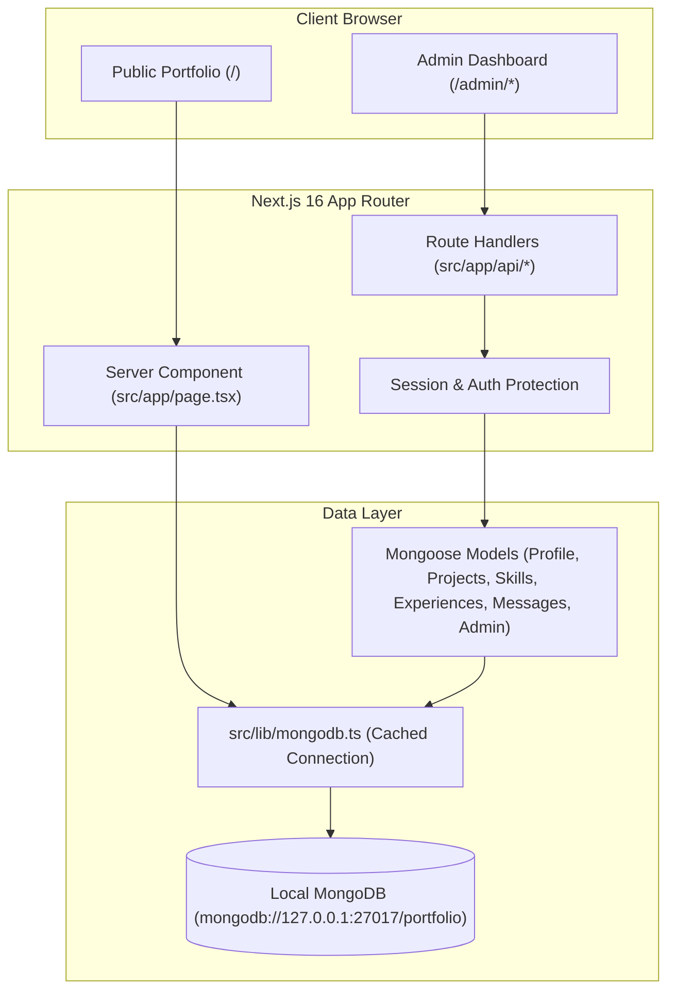

# Dynamic Portfolio & Admin Dashboard Implementation Plan

Implement a full-featured, secure, and modern **Admin Dashboard** for the portfolio, powered by **MongoDB (localhost:27017)** and **Mongoose**, with **Next.js App Router Route Handlers (`src/app/api/...`)** and dynamic data rendering across every portfolio section.

---

## Architecture Overview

---

## User Review Required

> [!IMPORTANT]
> **MongoDB Verification**: We tested your local system and confirmed that MongoDB is already running and accessible at `127.0.0.1:27017`. We will use `mongodb://127.0.0.1:27017/portfolio` in `.env.local`.

> [!IMPORTANT]
> **Dependencies to Add**:
> - `mongoose`: For MongoDB modeling and connection pooling.
> - `bcryptjs` & `@types/bcryptjs`: For secure password hashing.
> - `jose`: Standard, lightweight JWT token creation and verification compatible with Next.js App Router.

---

## Open Questions & Choices for You

1. **Admin Authentication Preference**:
   - **Default proposal**: A secure login route (`/admin/login`) with an `Admin` model and an initial seed account (e.g. username: `admin`, password generated or set in `.env.local`). Sessions stored in an `httpOnly` secure JWT cookie.
   - *Do you have a specific username or password preference for your initial local login, or should we set a default like `admin` / `admin123` that you can change anytime?*

2. **Data Migration / Seeding**:
   - We will create an automated `/api/seed` route handler and button in the admin interface to automatically export all your current static data (Hero details, Projects, Skills, Experiences, Social links) directly into your local MongoDB. This ensures zero downtime or missing content when switching to dynamic rendering.

---

## Proposed Changes

### 1. Database & Models (`src/lib` and `src/models`)

#### [NEW] [mongodb.ts](file:///c:/Web-dev-Projects/CODING/personal-portfolio/src/lib/mongodb.ts)
- Connection manager with global caching pattern for Next.js to prevent exhausting connections during development hot reloads.
- Graceful connection error logging and fallback handling.

#### [NEW] Mongoose Models:
- **`src/models/Profile.ts`**: Single-document schema storing:
  - Hero info: Name, roles (typewriter list), bio blurb, availability status & text, avatar image path, CV file/link, floating tech badges.
  - About info: Section heading, bio paragraphs, "currently building" badge, stats cards (`value`, `label`, `icon`), and highlight cards (`emoji`, `text`).
  - Contact & Socials: Email, phone, WhatsApp number, WhatsApp prefill message, location, and social links (GitHub, LinkedIn, Twitter, etc.).
- **`src/models/Project.ts`**: `title`, `description`, `longDesc`, `image`, `tags`, `github`, `live`, `emoji`, `featured`, `stars`, `order`.
- **`src/models/Skill.ts`**: `name`, `icon`, `level` (0-100), `color`, `category` ("Web Development", "Analytics & Tracking", etc.), `order`.
- **`src/models/SkillTag.ts`**: Familiar tech tags ("DataLayer Architecture", "Server-Side Tracking", etc.).
- **`src/models/Experience.ts`**: `role`, `company`, `companyUrl`, `location`, `period`, `type`, `bullets`, `tags`, `current`, `order`.
- **`src/models/Message.ts`**: `name`, `email`, `subject`, `message`, `read`, `createdAt`.
- **`src/models/Admin.ts`**: `username`, `passwordHash`, `role`.

---

### 2. Next.js Route Handlers (`src/app/api/...`)

All route handlers follow Next.js 16 conventions (async `params` resolution where applicable) and return JSON responses.

#### [NEW] Auth API:
- `POST /api/auth/login`: Validates credentials, creates signed JWT session cookie.
- `POST /api/auth/logout`: Clears cookie.
- `GET /api/auth/me`: Verifies current session.

#### [NEW] Content CRUD APIs:
- `/api/profile`: `GET` (public/admin), `PUT` (admin protected) to update Hero, About, and Contact settings.
- `/api/projects`: `GET` (list all projects), `POST` (create project).
- `/api/projects/[id]`: `GET`, `PUT`, `DELETE`.
- `/api/skills`: `GET` (list skills & tags), `POST` (create skill / tag).
- `/api/skills/[id]`: `PUT`, `DELETE`.
- `/api/experiences`: `GET` (list experiences), `POST` (create experience).
- `/api/experiences/[id]`: `PUT`, `DELETE`.
- `/api/messages`:
  - `POST`: Public endpoint used by [ContactSection.tsx](file:///c:/Web-dev-Projects/CODING/personal-portfolio/src/components/ContactSection.tsx) to save real messages to MongoDB.
  - `GET`, `PATCH` (mark read), `DELETE`: Admin endpoints to review inquiries.
- `/api/seed`: One-click seeder to populate MongoDB with the portfolio's existing static data.

---

### 3. Dynamic Public Portfolio Integration

#### [MODIFY] [page.tsx](file:///c:/Web-dev-Projects/CODING/personal-portfolio/src/app/page.tsx)
- Fetch dynamic data on the server with fallback to existing default data if database is empty.
- Pass dynamic props to:
  - [HeroSection.tsx](file:///c:/Web-dev-Projects/CODING/personal-portfolio/src/components/HeroSection.tsx)
  - [AboutSection.tsx](file:///c:/Web-dev-Projects/CODING/personal-portfolio/src/components/AboutSection.tsx)
  - [SkillsSection.tsx](file:///c:/Web-dev-Projects/CODING/personal-portfolio/src/components/SkillsSection.tsx)
  - [ProjectsSection.tsx](file:///c:/Web-dev-Projects/CODING/personal-portfolio/src/components/ProjectsSection.tsx)
  - [ExperienceSection.tsx](file:///c:/Web-dev-Projects/CODING/personal-portfolio/src/components/ExperienceSection.tsx)
  - [ContactSection.tsx](file:///c:/Web-dev-Projects/CODING/personal-portfolio/src/components/ContactSection.tsx)
  - [Footer.tsx](file:///c:/Web-dev-Projects/CODING/personal-portfolio/src/components/Footer.tsx)
  - [FloatingChatWidget.tsx](file:///c:/Web-dev-Projects/CODING/personal-portfolio/src/components/FloatingChatWidget.tsx)

#### [MODIFY] [ContactSection.tsx](file:///c:/Web-dev-Projects/CODING/personal-portfolio/src/components/ContactSection.tsx)
- Connect real form submission to `POST /api/messages` instead of simulated timeout.

---

### 4. Admin Dashboard UI (`src/app/admin/...`)

Designed with the existing modern dark aesthetic (OKLCH color system, glassmorphism, glowing borders, smooth hover interactions).

#### [NEW] Pages & Structure:
- **`src/app/admin/login/page.tsx`**: High-aesthetic login screen.
- **`src/app/admin/layout.tsx`**: Admin navigation shell with:
  - Responsive sidebar navigation (Dashboard, Hero & About, Projects, Skills, Experience, Messages, Settings).
  - Top header with Quick Links (View Live Portfolio, Database Status indicator, Admin Profile, Logout).
- **`src/app/admin/page.tsx`**: Dashboard Overview
  - Quick statistics (Total Projects, Skills, Experience, Unread Messages count).
  - Recent messages feed.
  - Database seed & sync utility button.
- **`src/app/admin/hero-about/page.tsx`**:
  - Live form to edit name, typewriter roles, bio, availability badge, currently building item, about paragraphs, stats cards, and highlights.
- **`src/app/admin/projects/page.tsx`**:
  - Grid/Table of projects with Add, Edit, Delete, Reorder, and toggle "Featured" status.
- **`src/app/admin/skills/page.tsx`**:
  - Visual skill manager: category selection, slider for proficiency percentage, color picker/preset, icon/emoji picker, and tags list.
- **`src/app/admin/experience/page.tsx`**:
  - Timeline management: Add/edit job roles, employment type badges, bullet points list builder, and tech tags.
- **`src/app/admin/messages/page.tsx`**:
  - Contact inbox: read messages, mark as read/unread, delete, view contact details and timestamps.
- **`src/app/admin/settings/page.tsx`**:
  - Social media links management, WhatsApp widget configurations, and contact information.

---

## Verification Plan

### Automated / Build Verification
- Install packages: `npm install mongoose bcryptjs jose` and `npm install -D @types/bcryptjs`.
- Run type check & build: `npm run build` to confirm zero TypeScript errors and ensure Next.js App Router complies with dynamic route parameter rules.

### Functional Verification
1. **Local MongoDB Connection**: Verify route handlers successfully connect to `mongodb://127.0.0.1:27017/portfolio`.
2. **Seed Initial Data**: Call `/api/seed` and verify all current static data is stored in the database.
3. **Admin Authentication**:
   - Access `/admin` -> redirect to `/admin/login` if not authenticated.
   - Log in with credentials -> session cookie created and redirect to `/admin`.
4. **CRUD Actions**:
   - Add a new test Project via `/admin/projects` -> verify it shows immediately on the homepage `/`.
   - Update a Skill percentage via `/admin/skills` -> verify update on homepage `/`.
   - Submit a message from public contact form -> verify it appears in `/admin/messages`.
   - Logout -> verify `/admin` routes are locked.
