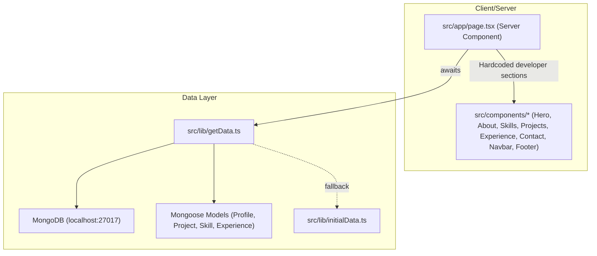
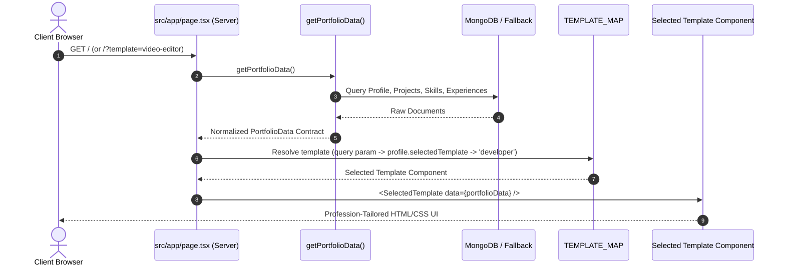

# Multi-Profession Portfolio Platform: Multi-Template Architecture Implementation Plan

This implementation plan defines the architectural blueprint, data flow, normalized contract, folder structure, template registry, and incremental implementation phases for transforming the portfolio into a multi-profession platform supporting **Developer**, **Video Editor**, and **Digital Marketer** templates with strict adherence to **DATA ≠ PRESENTATION**.

---

## 1. Current Architecture



* **Data Coupling**: `src/app/page.tsx` directly renders developer-specific components (`HeroSection`, `AboutSection`, `SkillsSection`, `ProjectsSection`, `ExperienceSection`).
* **Monolithic Presentation**: The UI is tightly coupled to a single developer persona (MERN stack, typewriter code roles, GitHub links).
* **Templates**: No template abstraction or dynamic switching mechanism exists.

---

## 2. Proposed Architecture

```mermaid
graph TD
    subgraph Data & Server Layer
        DB[("MongoDB (Single Normalized Schema)")]
        GetData["getPortfolioData() (Normalized Data Fetcher)"]
        Contract["PortfolioData Interface (src/types/portfolio.ts)"]
        RootPage["src/app/page.tsx (Server Component)"]
    end

    subgraph Template Orchestration
        Resolver["Template Resolver (resolveTemplateId)"]
        Registry["TEMPLATE_MAP (src/templates/index.ts)"]
    end

    subgraph Presentation Layer (Templates)
        DevTemplate["DeveloperTemplate (src/templates/developer)"]
        VideoTemplate["VideoEditorTemplate (src/templates/video-editor)"]
        MarketerTemplate["DigitalMarketerTemplate (src/templates/digital-marketer)"]
    end

    DB --> GetData
    GetData --> Contract
    Contract --> RootPage
    RootPage --> Resolver
    Resolver --> Registry
    Registry --> DevTemplate
    Registry --> VideoTemplate
    Registry --> MarketerTemplate
```

* **Core Axiom**: `DATA ≠ PRESENTATION`. One database, one set of API routes, one normalized data contract.
* **Pure Presentation**: Templates are dumb presentation components receiving data exclusively through props: `<Template data={portfolioData} />`.
* **Zero DB / API Access in Templates**: No template communicates with MongoDB or triggers data-fetching APIs.
* **Extensibility**: Adding a future template (e.g., `3D Artist`, `UI/UX Designer`) requires zero database migrations—only a new template folder registered in `TEMPLATE_MAP`.

---

## 3. Data Flow



### Data Translation Without Data Duplication

The same data records are interpreted uniquely by each profession template:

| Field | Developer Presentation | Video Editor Presentation | Digital Marketer Presentation |
| :--- | :--- | :--- | :--- |
| **`projects[i].title`** | App/Software Title | Production / Film / Reel Title | Campaign / Case Study Name |
| **`projects[i].image`** | UI/Code Screenshot | 16:9 Video Still / Poster Frame | Dashboard Metric / Campaign Visual |
| **`projects[i].tags`** | Next.js, TypeScript, Node.js | Premiere Pro, DaVinci, After Effects | Google Ads, GA4, Meta Ads, SEO |
| **`projects[i].description`**| Tech Summary | Project Brief & Concept | Business Problem & Objective |
| **`projects[i].longDesc`** | Architecture & Features | Production Workflow & Deliverables | Strategy, Execution & Business Impact |
| **`projects[i].live`** | Live App Web URL | Full Video / Reel Player / Embed | Live Case Study / Campaign Landing |
| **`projects[i].github`** | GitHub Source Code Repo | Behind the Scenes / Raw Assets Link | Client Proof / Analytics Deck |
| **`projects[i].stars`** | GitHub Stars | Client Rating / Impact Index | Performance Lift / ROI Multiplier |
| **`skills[i]`** | Code Stack & Proficiency | Post-Production Suite & Gear | Growth Channels & MarTech Stack |
| **`experiences[i]`** | Software Engineering Roles | Production & Agency Post Credits | Growth Engagements & Client Wins |

---

## 4. Template Interface

Every template implements the exact same TypeScript contract:

```typescript
// src/types/portfolio.ts

export interface PortfolioData {
  profile: ProfileData;
  projects: ProjectData[];
  skills: SkillData[];
  skillTags: string[];
  experiences: ExperienceData[];
}

export interface TemplateProps {
  data: PortfolioData;
}
```

Usage in templates:
```tsx
export default function DeveloperTemplate({ data }: TemplateProps) { ... }
export default function VideoEditorTemplate({ data }: TemplateProps) { ... }
export default function DigitalMarketerTemplate({ data }: TemplateProps) { ... }
```

Template Registry (`src/templates/index.ts`):
```typescript
export const TEMPLATE_MAP = {
  developer: DeveloperTemplate,
  "video-editor": VideoEditorTemplate,
  "digital-marketer": DigitalMarketerTemplate,
} as const;

export type TemplateId = keyof typeof TEMPLATE_MAP;
```

---

## 5. Folder Structure

```
src/
├── app/
│   ├── page.tsx                           # Master server component orchestrator
│   ├── admin/
│   │   ├── settings/page.tsx              # Added template switcher selector
│   │   └── ...
│   └── api/
│       └── profile/route.ts               # Accepts selectedTemplate
├── types/
│   └── portfolio.ts                       # Normalized PortfolioData & TemplateProps contracts
├── templates/
│   ├── index.ts                           # Template registry & resolver
│   ├── developer/                         # Template 1: Developer
│   │   ├── index.tsx                      # <DeveloperTemplate data={data} />
│   │   └── components/
│   │       ├── DevNavbar.tsx
│   │       ├── DevHero.tsx
│   │       ├── DevSkills.tsx
│   │       ├── DevProjects.tsx
│   │       ├── DevExperience.tsx
│   │       └── DevFooter.tsx
│   ├── video-editor/                      # Template 2: Video Editor
│   │   ├── index.tsx                      # <VideoEditorTemplate data={data} />
│   │   └── components/
│   │       ├── VideoNavbar.tsx
│   │       ├── VideoHero.tsx              # Showreel player hero & cinematic badges
│   │       ├── VideoGrid.tsx              # 16:9 widescreen video gallery with modal player
│   │       ├── VideoToolkit.tsx           # Editing software & hardware badges
│   │       ├── VideoCredits.tsx           # Film/commercial timeline credits
│   │       ├── VideoModal.tsx             # Interactive video/showreel lightbox
│   │       └── VideoFooter.tsx
│   └── digital-marketer/                  # Template 3: Digital Marketer
│       ├── index.tsx                      # <DigitalMarketerTemplate data={data} />
│       └── components/
│           ├── MarketerNavbar.tsx
│           ├── MarketerHero.tsx           # Executive ROI hero & KPI ticker bar
│           ├── MarketerCaseStudies.tsx    # Problem -> Strategy -> Results breakdown
│           ├── MarketerGrowthStack.tsx    # MarTech & Analytics stack
│           ├── MarketerImpactTimeline.tsx # Growth track record & revenue milestones
│           ├── MarketerAuditCta.tsx       # Strategic audit inquiry CTA
│           └── MarketerFooter.tsx
├── components/
│   ├── shared/                            # Reusable cross-template functional elements
│   │   ├── ContactForm.tsx                # Submits to /api/messages
│   │   ├── FloatingChatWidget.tsx         # WhatsApp & Messenger floating launcher
│   │   ├── ThemeToggle.tsx
│   │   └── icons.tsx
│   └── ui/                                # shadcn primitives (button, badge, dialog, etc.)
└── models/
    └── Profile.ts                         # Added selectedTemplate field ("developer" default)
```

---

## 6. Which Components Should Be Shared

* **Shared Functional & Infrastructure Components**:
  * `ContactFormLogic`: Submitting inquiries to `/api/messages`, form validation, loading states, and toast notifications.
  * `FloatingChatWidget`: Global floating WhatsApp and Messenger quick-action popup bubble.
  * `GTMProvider` / `src/lib/gtm.ts`: Analytics and event tracking hooks (`trackPageView`, `trackProjectClick`, `trackContactSubmit`).
  * `ModeToggle` / `ThemeProvider`: Light/dark mode switching.
  * `icons.tsx`: Brand and SVG icons (GitHub, LinkedIn, Twitter, WhatsApp, Messenger).
  * `src/components/ui/*`: Primitives (Button, Dialog/Modal, Card, Badge, Dropdown).

---

## 7. Which Components Should Remain Template-Specific

* **Template-Specific Visual & Layout Components**:
  * **Navbars & Headers**: Developer has code-brand `Sahadat.dev`; Video Editor has cinematic studio brand with Reel CTA; Digital Marketer has executive advisory brand with "Request Audit" CTA.
  * **Hero Sections**: Developer has terminal typewriter & tech badges; Video Editor has full widescreen cinematic showreel preview; Digital Marketer has KPI stat tickers and conversion value propositions.
  * **Projects / Showcase Sections**: Developer uses GitHub/Live cards with tech pills; Video Editor uses 16:9 film cards with duration/resolution tags and video play modals; Digital Marketer uses Case Study cards structured as Problem → Strategy → Results → Metrics.
  * **Skills Sections**: Developer shows code level percentage bars; Video Editor shows creative suite (Premiere, DaVinci, After Effects, Sound); Digital Marketer shows MarTech & Growth channels (GA4, GTM, Ads, CRO).
  * **Experience Sections**: Developer displays engineering architecture history; Video Editor displays commercial video credits and client deliverables; Digital Marketer displays revenue and growth milestones.
  * **Footers**: Themed strictly to match each template's visual world.

---

## 8. Potential Risks & Mitigation

1. **Risk**: Existing data fields might be formatted with developer phrasing (e.g. "Full Stack MERN Developer").
   * **Mitigation**: The Video Editor and Digital Marketer templates will implement smart role mapping and presentation fallbacks. If the user profile contains developer roles, the template displays the primary role while accentuating the profession-specific theme seamlessly.
2. **Risk**: Media assets (videos vs static images).
   * **Mitigation**: The Video Editor template will render high-definition thumbnail posters with video play overlays, opening a modal video preview or navigating to the project's `live` URL. If no video URL is present, it renders an embedded showcase preview.
3. **Risk**: Performance and hydration mismatch.
   * **Mitigation**: Server Component `src/app/page.tsx` resolves the template ID and passes server-fetched `PortfolioData` directly as props, guaranteeing zero client-side layout shift or hydration mismatch.
4. **Risk**: Breaking existing admin dashboard or public site.
   * **Mitigation**: `selectedTemplate` defaults to `"developer"`, preserving 100% of existing visual and functional behavior until explicitly toggled.

---

## 9. Execution Phases

* [ ] **Phase 1 & 2**: Codebase & schema inspection *(Completed during research)*.
* [ ] **Phase 3**: Create normalized `src/types/portfolio.ts` contract and update `Profile` model schema with `selectedTemplate`.
* [ ] **Phase 4 & 5**: Create template registry `src/templates/index.ts` and template resolver.
* [ ] **Phase 6**: Implement `DeveloperTemplate` (`src/templates/developer/`), ensuring 100% feature and visual parity with current portfolio.
* [ ] **Phase 7**: Implement `VideoEditorTemplate` (`src/templates/video-editor/`) with cinematic theme, showreel hero, 16:9 video gallery, video modal player, and post-production toolkit.
* [ ] **Phase 8**: Implement `DigitalMarketerTemplate` (`src/templates/digital-marketer/`) with data-driven executive theme, KPI metric tickers, Problem → Strategy → Results case study cards, and MarTech growth stack.
* [ ] **Phase 9**: Wire `src/app/page.tsx` to dynamically render templates based on `selectedTemplate` and `?template=` query parameter. Verify all 3 templates with the exact same MongoDB data.
* [ ] **Phase 10**: Update `src/app/admin/settings/page.tsx` with a visual Template Switcher to allow instant toggling between Developer, Video Editor, and Digital Marketer templates.

---

## Verification Plan

### Automated Verification
* `npm run lint` & `npm run build`: Verify zero TypeScript errors and Next.js 16 type compliance (including async `searchParams` handling).

### Manual Verification
1. **Developer Template**: Visit `http://localhost:3000/?template=developer` -> verify tech aesthetic, typewriter hero, skills bars, project cards, and experience timeline.
2. **Video Editor Template**: Visit `http://localhost:3000/?template=video-editor` -> verify cinematic aesthetic, showreel hero, video gallery, video modal player, and post-production toolkit.
3. **Digital Marketer Template**: Visit `http://localhost:3000/?template=digital-marketer` -> verify executive analytics theme, KPI metric tickers, Problem-Strategy-Results case studies, and MarTech stack.
4. **Data Independence**: Update a project or skill in Admin -> verify the change reflects across all three templates immediately without modifying code.
5. **Admin Switching**: Change template in `/admin/settings` -> verify visiting `/` loads the selected template by default.
